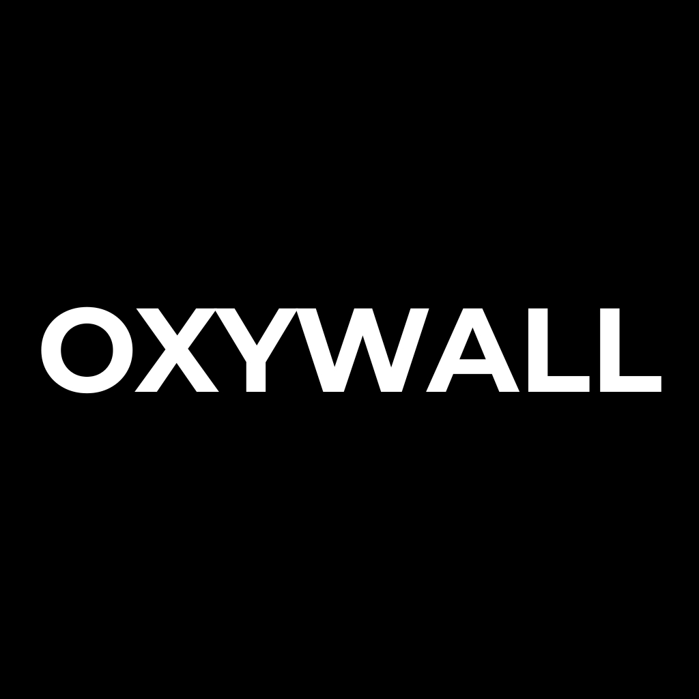

# Oxywall
## Rust terminal wallpaper downloader
---
## Languages supported
- English
---
## Platforms
| | Linux ARM64 | Linux x64 | Mac ARM64 | Windows x64 |
|---|:---:|:---:|:---:|:---:|
| Oxywall | ✅ | ✅ | 🛠️ | ✅ |
---
## Building from source
### Linux Arm
- cargo build --target=aarch64-unknown-linux-gnu
### Linux x64, Windows
- cargo build
---
## Quick Start

1. Download the latest release from [Releases](../../releases)
2. Run the app
3. - Create a .env file next to the script with your API keys:
- PEXELS_API_KEY
- PIXABAY_API_KEY
- UNSPLASH_API_KEY
4. There are categories and subcategories that rotate
5. It will donwload in 1920*1080 p or 3840**2160p
6. Enjoy !
---
## License

This project is licensed under the GNU General Public License v3.0 — see Licenses.md for details.

---
## Roadmap

## 🔴 NOW
## 🟡 NEXT
 - ### Release:
   - Chocolatey
   - MS Store
   - Winget
## 🔵 LATER
---